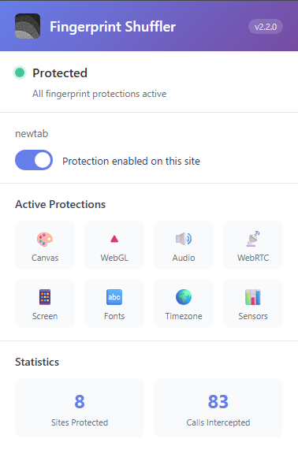

# Browser Fingerprint Shuffler



Chrome extension that protects against browser fingerprinting by adding deterministic noise to fingerprinting APIs. Creates a unique, consistent fingerprint per website while keeping functionality intact.

## Features

- **Canvas & WebGL Protection** - Adds pixel-level noise to prevent canvas fingerprinting
- **Screen Spoofing** - Hides real screen resolution with realistic alternatives
- **Navigator Fuzzing** - Randomizes hardware concurrency, device memory, and languages
- **Timezone Protection** - Spoofs IANA timezone string while keeping times accurate
- **WebRTC Protection** - Prevents IP leaks through WebRTC
- **Audio Fingerprinting** - Adds noise to audio context fingerprints
- **Font Protection** - Randomizes font measurements
- **Automatic Rotation** - Periodically changes your fingerprint on schedule
- **Site Whitelist** - Disable protection for trusted sites via popup toggle
- **Statistics Tracking** - Monitor fingerprint reads and protected sites

## Installation

1. **Clone the repository**
   ```bash
   git clone https://github.com/Emlembow/browser-fingerprint-shuffler.git
   cd browser-fingerprint-shuffler
   ```

2. **Load in Chrome**
   - Open Chrome and go to `chrome://extensions/`
   - Enable **Developer mode** (toggle in top-right corner)
   - Click **Load unpacked**
   - Select the `browser-fingerprint-shuffler` folder

3. **Verify it's working**
   - Visit https://amiunique.org/fingerprint
   - Open DevTools Console (F12)
   - Look for: `[fp][page] All hooks installed successfully`
   - Click "Reset Fingerprint" in popup to see fingerprint change

## Configuration

Click the extension icon → **Settings** to configure:

- **Protection Toggles** - Enable/disable individual protections
- **Noise Strength** - Adjust canvas and WebGL noise levels
- **Auto-Rotation** - Schedule automatic fingerprint changes
- **Debug Mode** - Enable detailed console logging

Or edit `core/config.js` directly for advanced settings.

## How It Works

The extension uses a dual-world architecture:

1. **ISOLATED world** (content script) - Loads config from storage and manages state
2. **MAIN world** (page context) - Applies hooks directly to page APIs that websites can see

Each protection uses deterministic PRNG seeded from a persistent salt, ensuring:
- Same fingerprint per site across sessions
- Different fingerprint per site (optional)
- Fingerprint changes only when you rotate the salt

### Protected APIs

| API | Protection Method |
|-----|-------------------|
| Canvas | Pixel-level Gaussian noise |
| WebGL | Parameter jittering, vendor masking |
| Screen | Resolution spoofing from real-world distribution |
| Navigator | Hardware concurrency/memory fuzzing |
| Timezone | IANA zone switching (same UTC offset) |
| Audio | Audio context sample noise |
| Fonts | Measurement randomization |
| WebRTC | IP leak prevention, SDP randomization |

## Usage

### Popup Controls
- **Toggle protection per site** - Whitelist trusted sites
- **Reset Fingerprint** - Generate new fingerprint immediately
- **View statistics** - See protected sites and API reads

### Automatic Rotation
1. Open Settings → **General**
2. Enable **Auto-Rotation**
3. Choose interval (1h - 7 days)
4. Optional: Enable **Rotate on Startup**

### Timezone Spoofing
The smart timezone spoofing keeps times accurate while changing your fingerprint:
- **Real:** America/Los_Angeles (offset 480)
- **Spoofed:** America/Vancouver (same offset 480)
- Times display correctly, but timezone identifier changes!

## Testing

**Test on AmIUnique:**
1. Visit https://amiunique.org/fingerprint
2. Export fingerprint (before)
3. Click "Reset Fingerprint" in popup
4. Export fingerprint (after)
5. Compare - canvas, screen, timezone should differ

**Console verification:**
```javascript
// Check screen spoofing
console.log('Screen:', screen.width, 'x', screen.height);

// Check timezone spoofing
console.log('Timezone:', Intl.DateTimeFormat().resolvedOptions().timeZone);

// Check canvas protection (run twice - should be identical)
const c = document.createElement('canvas');
c.width = 200; c.height = 50;
const ctx = c.getContext('2d');
ctx.fillText('test', 10, 20);
console.log('Canvas:', c.toDataURL().substring(0, 50));
```

## Architecture

```
content/
├── page_world_injector.js    # Hooks in MAIN world (page context)
├── bootstrap.js               # Config loader and initialization
└── stats_tracker.js           # Statistics collection

core/
├── config.js                  # Configuration and defaults
├── salts.js                   # Persistent salt management
├── prng.js                    # Xoshiro128** PRNG
└── hash.js                    # Deterministic seed derivation

popup/                         # Popup UI (toggle, stats, reset)
options/                       # Settings page
background/                    # Service worker (rotation, stats)
```

## Development

**Enable debug logging:**
- Settings → Advanced → Enable **Debug Mode**
- Or set `debug: true` in `core/config.js`

**Console logs show:**
```
[fp][config] Loaded config: {...}
[fp][page][canvas] Hooks installed
[fp][page][screen] Real: 5120x1440, Spoofed: 1920x1080
[fp][page][timezone] Real offset: 480 Spoofed zone: America/Vancouver
```

**Hot reload:**
- Changes to settings apply immediately
- Changes to code require extension reload in `chrome://extensions`

## Privacy & Security

- **No data collection** - All fingerprints stored locally
- **No network requests** - Entirely offline operation
- **Deterministic** - Same fingerprint per site (until rotation)
- **Per-origin isolation** - Different fingerprint per website (configurable)

## Limitations

- Cannot modify HTTP headers (User-Agent, Accept-Language)
- Does not protect against CSS-based fingerprinting
- Does not prevent WebGL shader fingerprinting
- Timezone spoofing only affects JavaScript (not system timezone)

## License

See [LICENSE](LICENSE) file for details.

## Contributing

Issues and pull requests welcome! This project aims to balance privacy protection with website functionality.

## Credits

Original concept and architecture by [@Emlembow](https://github.com/Emlembow)

Enhanced with:
- Page-world hook injection for actual fingerprint protection
- Smart timezone spoofing (same offset, different zone)
- Automatic fingerprint rotation
- Statistics tracking and UI improvements
